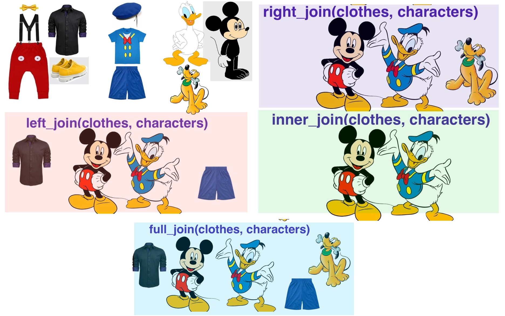

Tidy & Relational Data
======================

This chapter is part 2 (of 2) of _Cleaning & Reshaping Data_, a workshop
series about how to prepare data for analysis. The major topics of this chapter
are how to reshape datasets with pivots and how to combine related datasets
with joins

#### Learning Objectives {-}

After completing this session, learners should be able to:

* Explain what it means for data to be tidy
* Use the tidyr package to reshape data
* Explain what a relational dataset is
* Use the dplyr package to join data based on common columns
* Describe the different types of joins
* Identify which types of joins to use when faced with a relational dataset


Tidy Datasets
-------------

The structure of a dataset---its shape and organization---has enormous
influence on how difficult it will be to analyze, so making structural changes
is an important part of the cleaning process. Researchers conventionally
arrange tabular datasets so that each row contains a single **observation** or
case, and each column contains a single kind of measurement or identifier,
called a **feature**.

In 2014, [Hadley Wickham][hadley] refined and formalized the conventions for
tabular datasets by [introducing the concept of **tidy datasets**][tidy], which
have a specific structure. Paraphrasing Wickham, the rules for a tidy dataset
are:

[hadley]: https://hadley.nz/
[tidy]: https://vita.had.co.nz/papers/tidy-data.html

> 1. Every column is a single feature.
> 2. Every row is a single observation.
> 3. Every cell is a single value.

These rules ensure that all of the values in a dataset are visually organized
and are easy to access with indexing operations. They're also specific enough
to make tidiness a convenient standard for functions that operate on tabular
datasets. In fact, the [Tidyverse][tidyverse] packages (see Section
\@ref(the-tidyverse)) are designed from the ground up for working with tidy
datasets. Tidy datesets have also been adopted as a standard in other software,
including various packages for Python and Julia.

[tidyverse]: https://www.tidyverse.org/

This section explains how to **reshape** tabular datasets into tidy datasets.
While reshaping can seem tricky at first, making sure your dataset has the
right structure before you begin analysis saves time and frustration in the
long run.

<!--
The Tidyverse is so named because many functions in Tidyverse packages require
data frames that are in **tidy** form. Before we see the requirements for a
data set to be tidy, we need to define or review some terminology from
statistics.

A **feature** (also called a **covariate** or a **variable**) is a measurement
of something, usually across multiple subjects. For example, we might decide to
measure the heights of everyone in the class. Each person in the class is a
subject, and the height measurement is a feature. Features don't have to be
quantitative. If we also asked each person their favorite color, then favorite
color would be another feature in our data set. Features are usually, but not
always, the columns in a tabular data set.

An **observation** is a set of features measured for a single subject or at a
single time. So in the preceding example, the combined height and favorite
color measurement for one student is one observation. Observations are usually,
but not always, the rows in a tabular data set.
-->


### The tidyr Package

The [tidyr][] package provides functions to reshape tabular datasets. It also
provides examples of tidy and untidy datasets. Like most Tidyverse packages, it
comes with detailed [documentation][tidyr] and a [cheatsheet][tidyr-cheat].

[tidyr]: https://tidyr.tidyverse.org/
[tidyr-cheat]: https://github.com/rstudio/cheatsheets/blob/main/tidyr.pdf

As usual, install the package if you haven't already, and then load it:

```{r}
# install.packages("tidyr")
library(tidyr)
```

Let's start with an example of a tidy dataset. The `table1` dataset in the
package records the number of tuberculosis cases across several different
countries and years:

```{r}
table1
```

Each of the four columns contains a single kind of measurement or identifier,
so the dataset satifies tidy rule 1. The measurements were taken at the
country-year level, and each row contains data for one country-year pair, so
the dataset also satisfies tidy rule 2. Each cell in the data frame only
contains one value, so the dataset also satisfies tidy rule 3.

The same data are recorded in `table2`, `table3`, and the pair `table4a` with
`table4b`, but these are all *untidy* datasets. For example, `table2` breaks
rule 1 because the column `count` contains two different kinds of
measurements---case counts and population counts:

```{r}
table2
```

When considering whether you should reshape a dataset, think about what the
features are and what the observations are. These depend on the dataset itself,
but also on what kinds of analyses you want to do. Datasets sometimes have
closely related features or multiple (nested) levels of observation. The tidyr
documentation includes a [detailed article on how to reason about reshaping
datasets][tidyr-tidy].

[tidyr-tidy]: https://tidyr.tidyverse.org/articles/tidy-data.html

If you do decide to reshape a dataset, then you should also think about what
role each feature serves:

* **Identifiers** are labels that distinguish observations from one another.
  They are often but not always categorical. Examples include names or
  identification numbers, treatment groups, and dates or times. In the
  tuberculosis data set, the `country` and `year` columns are identifiers.

* **Measurements** are the values collected for each observation and typically
  the values of research interest. For the tuberculosis data set, the `cases`
  and `population` columns are measurements.

Having a clear understanding of which features are identifiers and which are
measurements makes it easier to use the tidyr functions.


### Rows into Columns

Tidy data rule 1 is that each column must be a single feature. The `table2`
dataset breaks this rule:

```{r}
table2
```

To make the dataset tidy, the measurements in the `count` column need to be
separated into two separate columns, `cases` and `population`, based on the
categories in the `type` column.

You can use the `pivot_wider` function to **pivot** the single `count` column
into two columns according to the `type` column. This makes the dataset wider,
hence the name `pivot_wider`.

The function's first parameter is the dataset to pivot. Other important
parameters are:

* `values_from` -- The column(s) to pivot.
* `names_from` -- The column that contains names for the new columns.
* `id_cols` -- The identifier columns, which are not pivoted. This defaults to
  all columns except those in `values_from` and `names_from`.

Here's how to use the function to make `table2` tidy:

```{r}
pivot_wider(table2, values_from = count, names_from = type)
```

The function automatically removes values from the `country` and `year` columns
as needed to maintain their original correspondence with the pivoted values.


### Columns into Rows

Tidy data rule 2 is that every row must be a single observation. The `table4a`
and `table4b` datasets break this rule because each row in each dataset
contains measurements for two different years:

```{r}
table4a
table4b
```

The tuberculosis case counts are in `table4a`. The population counts are in
`table4b`. Neither is tidy.

To make the `table4a` dataset tidy, the `1999` and `2000` columns need to be
pivoted into two new columns: one for the measurements (the counts) and one for
the identifiers (the years). It might help to visualize this as stacking the
two separate columns `1999` and `2000` together, one on top of the other, and
then adding a second column with the appropriate years. The same process makes
`table4b` tidy.

You can use the `pivot_longer` function to pivot the two columns `1999` and
`2000` into a column of counts and a column of years. This makes the dataset
longer, hence the name `pivot_longer`.

Again the function's first parameter is the dataset to pivot. Other important
parameters are:

* `cols` -- The columns to pivot.
* `values_to` -- Name(s) for the new measurement column(s)
* `names_to` -- Name(s) for the new identifier column(s)

Here's how to use the function to make `table4a` tidy:

```{r}
tidy4a = pivot_longer(table4a, -country, values_to = "cases",
  names_to = "year")
tidy4a
```

In this case, the `cols` parameter is set to all columns *except* the `country`
column, because the `country` column does not need to be pivoted. The function
automatically repeats values in the `country` column as needed to maintain its
original correspondence with the pivoted values.

Here's the same for `table4b`:

```{r}
tidy4b = pivot_longer(table4b, -country, values_to = "population",
  names_to = "year")
tidy4b
```

Once the two datasets are tidy, you can join them with the `merge` function to
reproduce `table1`:

```{r}
merge(tidy4a, tidy4b)
```


### Separating Values

Tidy data rule 3 says each value must have its own cell. The `table3` dataset
breaks this rule because the `rate` column contains two values per cell:

```{r}
table3
```

The two values separated by `/` in the `rate` column are the tuberculosis case
count and the population count.

To make this dataset tidy, the `rate` column needs to be split into two
columns, `cases` and `population`. The values in the `rate` column are strings,
so one way to do this is with the stringr package's `str_split_fixed` function,
described in Section \@ref(splitting-strings):

```{r}
library(stringr)

# Split the rate column into 2 columns.
cols = str_split_fixed(table3$rate, fixed("/"), 2)

# Remove the rate column and append the 2 new columns.
tidy3 = table3[-3]
tidy3$cases = as.numeric(cols[, 1])
tidy3$population = as.numeric(cols[, 2])
tidy3
```

Extracting values, converting to appropriate data types, and then combining
everything back into a single data frame is an extremely common pattern in data
science.

The tidyr package provides the `separate` function to streamline the steps
taken above. The first parameter is the dataset, the second is the column to
split, the third is the names of the new columns, and the fourth is the
delimiter. The `convert` parameter controls whether the new columns are
automatically converted to appropriate data types:

```{r}
separate(table3, rate, c("cases", "population"), "/", convert = TRUE)
```

As of writing, the tidyr developers have deprecated the `separate` function in
favor of several more specific functions (`separate_wider_delim`,
`separate_wider_position`, and `separate_wider_regex`). These functions are
still experimental, so we still recommend using the `separate` function in the
short term.


### Case Study: SMART Ridership

[Sonoma-Marin Area Rail Transit (SMART)][smart] is a single-line passenger rail
service between the San Francisco Bay and Santa Rosa. They publish [data about
monthly ridership][smart-riders] in PDF and Excel format. In this case study,
you'll reshape and clean the dataset to prepare it for analysis.

[smart]: http://sonomamarintrain.org/
[smart-riders]: https://www.sonomamarintrain.org/RidershipReports

To get started, download the [December 2022 report it Excel
format][smart-dec22]. Pay attention to where you save the file---or move it to
a directory just for files related to this case study---so that you can load it
into R. If you want, you can use R's `download.file` function to download the
file rather than your browser.

The [readxl][] package provides functions to read data from Excel files.
Install the package if you don't already have it installed, and then load it:

[smart-dec22]: https://www.sonomamarintrain.org/sites/default/files/Ridership%20Reports/SMART%20Ridership%20Web%20Posting_Dec.22.xlsx
[readxl]: https://readxl.tidyverse.org/

```{r load-readxl}
# install.packages("readxl")
library("readxl")
```

You can use the `read_excel` function to read a sheet from an Excel
spreadsheet. Before doing so, it's a good idea to manually inspect the
spreadsheet in a spreadsheet program. The SMART dataset contains two tables in
the first sheet, one for total monthly ridership and another for average
weekday ridership (by month).

Let's focus on the total monthly ridership table, which occupies cells B4 to
H16. You can specify a range of cells when you call `read_excel` by setting the
`range` parameter:

```{r read-smart-data}
smart_path = "./data/SMART Ridership Web Posting_Mar.23.xlsx"
smart = read_excel(smart_path, range = "B4:H16")
smart
```

The loaded dataset needs to be cleaned. The `FY18` column uses a hyphen to
indicate missing data and has the wrong data type. The dates---months and
years---are identifiers for observations, so the dataset is also not tidy.

You can correct the missing value in the `FY18` column with indexing, and the
type with the `as.numeric` function:

```{r}
smart$FY18[smart$FY18 == "-"] = NA
smart$FY18 = as.numeric(smart$FY18)
head(smart)
```

To make the dataset tidy, it needs to be reshaped so that the values in the
various fiscal year columns are all in one column. In other words, the dataset
needs to be pivoted longer (Section \@ref(columns-into-rows)). The result of
the pivot will be easier to understand if you rename the columns as their years
first. Here's one way to do that:

```{r}
names(smart)[-1] = 2018:2023
head(smart)
```

Next, use `pivot_longer` to pivot the dataset:

```{r pivot-smart-data}
smart = pivot_longer(smart, -Month, values_to = "riders",
  names_to = "fiscal_year")
head(smart)
```

Now the dataset is tidy, but it's still not completely clean. To make it easy
to study time trends, let's combine and convert the `month` and `fiscal_year`
columns into a calendar date. You can use functions from the lubridate package
(Section \@ref(the-lubridate-package)) to do this. First paste the year and
month together and use the `my` function to parse them as dates:

```{r}
library(lubridate)

dates = my(paste(smart$Month, smart$fiscal_year))
dates
```

The SMART fiscal year extends from July to the following June and equals the
calendar year at the end of the period. So for observations from July to
December, the calendar year is the fiscal year minus 1. You can use indexing to
make this adjustment efficiently, and then append the dates to the data frame:

```{r}
jul2dec = month(dates) >= 7
dates[jul2dec] = dates[jul2dec] - period(1, "year")
smart$date = dates
head(smart)
```

As a final adjustment, you can use the `tolower` function to convert the column
names to lowercase, so that they're easier to use during analysis:

```{r}
names(smart) = tolower(names(smart))
smart
```

Now that the dataset is tidied and cleaned, it's straightforward to do things
like plot it as a time series:

```{r smart-plot}
library("ggplot2")

ggplot(smart) + aes(x = date, y = riders) + geom_line() +
  expand_limits(y = 0)
```

Notice the huge drop (more than 90%) in April of 2020 due to the COVID-19
pandemic!


### Without tidyr

This section shows how to pivot datasets without the help of the tidyr package.
In practice, we recommend that you use the package, but the examples here may
make it easier to understand what's actually happening when you pivot a
dataset.

#### Rows into Columns

The steps for pivoting `table2` wider are:

1. Subset rows to separate `cases` and `population` values.
2. Remove the `type` column from each.
3. Rename the `count` column to `cases` and `population`.
4. Merge the two subsets by matching `country` and `year`.

And the code is:

```{r}
# Step 1
cases = table2[table2$type == "cases", ]
pop = table2[table2$type == "population", ]
# Step 2
cases = cases[-3]
pop = pop[-3]
# Step 3
names(cases)[3] = "cases"
names(pop)[3] = "population"
# Step 4
merge(cases, pop)
```

#### Columns into Rows

The steps for pivoting `table4a` longer are:

1. Subset columns to separate `1999` and `2000` into two data frames.
2. Add a `year` column to each.
3. Rename the `1999` and `2000` columns to `cases`.
4. Stack the two data frames with `rbind`.

And the code is:

```{r}
# Step 1
df99 = table4a[-3]
df00 = table4a[-2]
# Step 2
df99$year = "1999"
df00$year = "2000"
# Step 3
names(df99)[2] = "cases"
names(df00)[2] = "cases"
# Step 4
rbind(df99, df00)
```


Relational Datasets
-------------------

Many datasets contain multiple tables (or data frames) that are all closely
related to each other. Sometimes, the rows in one table may be connected the
rows in others through columns they have in common.

For example, our library keeps track of its books using three tables: one
identifying books, one identifying borrowers, and one that records each book
checkout. Each book and each borrower has a unique identification number,
recorded in the book and borrower tables, respectively. These ID numbers are
also recorded in the checkouts table. Using the ID numbers, you can connect
rows from one table to rows in another. We call this kind of dataset a
**relational** dataset, because there are relationships between the tables.

Storing relational datasets as several small tables rather than one large table
has many benefits. Perhaps the most important is that it reduces redundancy and
thereby reduces the size (in bytes) of the dataset. As a result, most
**databases** are designed to store relational datasets.

Because the data are split across many different tables, relational datasets
also pose a unique challenge: to explore, compute statistics, make
visualizations, and answer questions, you'll typically need to combine the data
of interest into a single table. One way to do this is with a **join**, an
operation that combines rows from two tables based on values of a column they
have in common. There are many different types of joins, which are covered in
the subsequent sections.


### The dplyr Package

The [dplyr][] package provides functions to join related data frames, among
other things. Check out [this list of all the functions provided by
dplyr][dplyr-ref].

[dplyr]: https://dplyr.tidyverse.org/
[dplyr-ref]: https://dplyr.tidyverse.org/reference/index.html

If you've ever used SQL, you're probably familiar with relational datasets and
recognize functions like `select`, `left_join`, and `group_by`. In fact,
`dplyr` was designed to bring SQL-style data manipulation to R. As a result,
many concepts of dplyr and SQL are nearly identical, and even the language
overlaps a lot. I'll point out some examples of this as we go, because I think
some people might find it helpful. If you haven't used SQL, don't worry---all
of the functions will be explained in detail.


### Gradebook Dataset

Another example of a relational dataset that we all interact with regularly is
the university gradebook. One table might store information about students and
another might store their grades. The grades are linked to the student records
by student ID. Looking at a student's grades requires combining the two tables
with a join.

Let's use a made-up gradebook dataset to make the idea of joins concrete. We'll
create two tables: the first identifies students by name and ID, and the second
lists their grades in a class.


```{r students-data}
# Example datasets
students = data.frame(
  student_id = c(1, 2, 3, 4),
  name = c("Angel", "Beto", "Cici", "Desmond"))

students
```

```{r grades-data}
grades = data.frame(
  student_id = c(2, 3, 4, 5, 6),
  grade = c(90, 85, 80, 75, 60))

grades
```

The rows and columns of these tables have different meanings, so we can't stack
them side-by-side or one on top of the other. The "key" piece of information
for linking them is the `student_id` column present in both.

In relational datasets, each table usually has a **primary key**, a column of
values that uniquely identify the rows. Key columns are important because they
link rows in one table to rows in other tables.

In the gradebook dataset, `student_id` is the primary key for the `students`
table. Although the values of `student_id` in the `grades` table are unique, it
is not a primary key for the `grades` table, because a student could have
grades for more than one class.

When one table's primary key is included in another table, it's called a
**foreign key**. So `student_id` is a foreign key in the `grades` table.

If you've used SQL, you've probably heard the terms primary key and foreign key
before. They have the same meaning in R.

In most databases, the primary key must be unique---there can be no duplicates.
That said, relational datasets are not always designed for use as databases,
and they may have key columns that are not unique. How to handle non-unique
keys is going to be a recurring feature of this section.


### Left Joins

Suppose we want a table with each student's name and grade. This is a
combination of information from both the `students` table and the `grades`
table, but how can we combine the two?

The `students` table contains the student names and has one row for each
student. So we can use the `students` table as a starting point. Then we need
to use each student's ID number to look up their grade in the `grades` table.

When you want combine data from two tables like this, you should think of using
a join. In joins terminology, the two tables are usually called the **left
table** and **right table** so that it's easy to refer to each without
ambiguity.

For this particular example, we'll use a **left join**. A left join keeps all
of the rows in the left table and combines them with rows from the right table
that match the primary key.

We want to keep every student in the `students` table, so we'll use it as the
left table. The `grades` table will be the right table. The key that links the
two tables is `student_id`. This left join will only keep rows from the
`grades` table that match student IDs present in the `students` table.

In dplyr, you can use the `left_join` function to carry out a left join. The
first argument is the left table and the second argument is the right table.
You can also set an argument for the `by` parameter to specify which column(s)
to use as the key. Thus:

```{r left-join-example}
#| message: false
# load dplyr package
library(dplyr)
library(knitr)

# Left join
left_join(students, grades, by = "student_id")
# |> kable()
```

Note that the keys do not match up perfectly between the tables: the `grades`
table has no rows with `student_id` 1 (Angel) and has rows with `student_id` 5
(an unknown student). Because we used a left join, the result has a missing
value (`NA`) in the grade column for Angel and no entry for `student_id` 5. A
left join augments the left table (`students`) with columns from the right
table (`grades`). So the result of a left join will often have the same number
of rows as the left table. New rows are not added for rows in the right table
with non-matching key values.

There is one case where the result of a left join will have more rows than the
left table: when a key value is repeated in either table. In that case, every
possible match will be provided in the result. For an example, let's add rows
with repeat IDs to both the `students` and `grades` tables. Let's also rename
the `student_id` column of `grades` to be `sid` so we can see how to join
tables where the key column names don't match.

```{r left-join-example-duplicate-keys}
# Example datasets
students = data.frame(
  student_id = c(1, 2, 3, 4, 4),
  name = c("Angel", "Beto", "Cici", "Desmond", "Erik"))

grades = data.frame(
  sid = c(2, 3, 4, 5, 2),
  grade = c(90, 85, 80, 75, 60))

# Left join
left_join(students, grades, by = join_by(student_id == sid))

#|> kable()
```

Both of the tables had five rows, but the result has six rows because
`student_id` is 4 for two rows of `students` and `sid` is 2 for two rows of
`grades`. R warns that there is a many-to-many relationship in the
join, which means that duplicate keys were matched in the left table and the
right table. When there are no duplicate keys in either table, the match is
one-to-one. When there are duplicates in one table only, the match is
one-to-many or many-to-one. These are often desired behavior and so R just
complies silently. A many-to-many match may be desired, but it is often a sign
that something has gone wrong, so R emits a warning. You can get funky results
when your keys are not unique!


### Other Joins

There are several other kinds of joins:

* A **right join** is almost the same as a left join, but reverses the roles of
  the left and right table. All rows from the right table are augmented with
  columns from the left table where the key matches.
* An **inner join** returns rows from the left and right tables only if they
  match (their key appears in both tables).
* A **full join** returns all rows from the left table and from the right
  table, even if they do not match.

Here's visualization to help identify the differences:



The following subsections provide examples of different types of joins.

#### Inner Join

An inner join returns the same columns as a left join, but potentially fewer
rows. The result of a inner join only includes the rows that matched according
to the join specification. This will leave out some rows from the left table if
they aren't matched in the right table, which is the difference between an
inner join and a left join.


```{r inner-join-example-duplicate-key}
# Example datasets
students = data.frame(
  student_id = c(1, 2, 3, 4, 4),
  name = c("Angel", "Beto", "Cici", "Desmond", "Erik"))

grades = data.frame(
  student_id = c(2, 3, 4, 5, 2),
  grade = c(90, 85, 80, 75, 60))

# Inner join
inner_join(students, grades, by = "student_id") |>
  kable()
```


### Getting Clever with `join_by`

So far, we've focused on the join types and the tables. There's been a third element in all of the examples that we've mostly ignored until now: the `by` argument in the joins. Specifying a single column name (like `student_id`) works great when the key columns have the same names in both tables. However, real examples are often more complicated. For those times, dplyr provides a function called `join_by`, which lets you create **join specifications** to solve even very complicated problems. We begin with an example where the key name in the `grades` table has been changed from `student_id` to `sid`.


```{r different-key-names}
# Example datasets
students = data.frame(
  student_id = c(1, 2, 3, 4),
  name = c("Angel", "Beto", "Cici", "Desmond"))

grades = data.frame(
  sid = c(2, 3, 4, 5),
  grade = c(90, 85, 80, 75))

# Left join
left_join(students, grades, by = join_by(student_id==sid)) |>
  kable()
```

Since the key column names don't match, I have provided a `join_by`
specification. Specifying a match via `join_by` is very powerful and flexible,
but the main thing to recognize here is that R searches for the column name on
the left of the double-equals in the left table and searches for the column
name on the right of the double-equals in the right table. In this example,
that means the join will try to match `students$student_id` to `grades$sid`.

#### Matching multiple columns

Sometimes it takes more than one key to uniquely identify a row of data. For example, suppose some of our students are retaking the class in 2023 because they got a failing grade in 2022. Then we would need to combine the student ID with the year to uniquely identify a student's grade. You can include multiple comparisons in a `join_by` specification by separating them with commas. In the following example, student ID still has different names between the tables but the year column has the same name in both tables.

```{r two-key-cols}
# Example datasets
students = data.frame(
  student_id = c(1, 2, 3, 4),
  name = c("Angel", "Beto", "Cici", "Desmond"))

# duplicate the students for two years
students = bind_rows(
  mutate(students, year = 2022),
  mutate(students, year = 2023)
)

# create the grades data.frame
grades = data.frame(
  sid = c(2, 3, 4, 5),
  grade = c(90, 85, 80, 75)
  )

# duplicate the grades table for two years
grades = bind_rows(
  mutate(grades, grade = grade - 50, year = 2022),
  mutate(grades, year = 2023)
)

# Left join
left_join(students, grades, by = join_by(student_id==sid, year)) |>
  kable()
```


To learn clever tricks for complicated joins, see the documentation at `?join_by`.


<!--
# 12. Conclusion and Resources (10 mins)
- Summary of key concepts learned.
- Recommended resources for further learning.


# Special topics

## Semi Joins
The semi_join() function in the dplyr package is used to return all rows from the first (left) data frame that have matching rows in the second (right) data frame based on specified columns. Unlike other join functions in dplyr, semi_join() only retains the rows from the left data frame where there is a match in the right data frame, but it does not include any columns from the right data frame in the result. It is a way to filter rows from the left data frame based on their presence in the right data frame.

### Syntax:
`semi_join(x, y, by = "common_column")`
`x`: The left data frame.
`y`: The right data frame.
`by`: A character vector specifying the column(s) by which the data frames should be joined.

### Example:

```{r semi-join-example}
# Example datasets
employees = data.frame(emp_id = c(1, 2, 3, 4),
                        name = c("Angel", "Beto", "Cici", "Desmond"))

salaries = data.frame(emp_id = c(2, 3, 4, 5),
                        salary = c(60000, 75000, 80000, 70000))

# Semi-join
semi_result = semi_join(employees, salaries, by = "emp_id")

# View the result
print(semi_result)
```

In this example, the `semi_join` function is used to retain only those rows from the `employees` data frame where the `emp_id` values have a match in the `salaries` data frame. The resulting `semi_result` will only contain the rows with `emp_id` values 2, 3, and 4.

### Use Cases:
Filtering rows in the left data frame based on the presence of matching values in the right data frame.
Useful when you are interested in a subset of records from the left data frame that has corresponding records in the right data frame.

## Anti Joins
The `semi_join` function is the opposite of `anti_join`, which returns rows from the left data frame that do not have matching rows in the right data frame.

```{r anti-join-example}
# Example of anti-join (rows in employees without a match in salaries)
anti_result = anti_join(employees, salaries, by = "emp_id")
```
-->

### Examples

We've seen enough of the made-up grades example! Let's look at some real data and practice our skills!

Let's begin by looking at the data on books, borrowers, and checkouts.

```{r import-data}
#| warning: false
#| error: false
#| message: false
borrowers = read.csv("data/library/borrowers.csv")
books = read.csv("data/library/books.csv")
checkouts = read.csv("data/library/checkouts.csv")

# show the top rows
print(head(books))
print(head(borrowers))
print(head(checkouts))

# get the table sizes
print(dim(books))
print(dim(borrowers))
print(dim(checkouts))
```

One thing we can see is that the `books` table refers to physical copies of a book, so if the library owns two copies of the same book then the same title, publisher, etc. will appear on the same row.

In the previous section, we set a goal of augmenting the `checkouts` table with the information in the `books` table. To augment means to add to. We are going to be adding to the `checkouts` table, but do we add rows or columns? Each row of `checkouts` is an event that matches one book and one borrower. Adding new rows would be like adding new events that didn't occur: not good! Each row has a book and each book has many columns of information in the `books` table. So we can maintain the relationships in the data while adding new columns of information to `checkouts`.

How are we to know which books were checked out most often, or were generaly checked out by the same people? The tables have different numbers of rows and columns, so we won't be able to stack them side-by-side or one on top of the other. The "key" pieces of information are the columns `books$book_id` and `borrowers$borrower_id`. If you've ever used SQL, you may recall that each table should have a **primary key**, which is a column of values that identify the rows. In a database, the primary key must be unique - there can be no duplicates. Most spreadsheets are not designed as databases, and they may have key or ID columns that are not unique. How to handle non-unique keys is going to be a recurring feature of this workshop.

Now look at the `checkouts` table again. It has two ID columns: `book_id` and `borrower_id`. These match the borrower and book IDs in the `borrowers` and `books` tables. Obviously, these aren't unique: one person may check out multiple books, and an exceptionaly popular book might be checked out as many as three times from the same library! These are columns that identify unique keys other tables, which SQL calls **foreign keys**.

Now we can begin to reason about how to approach the goal of identifying the books that are most often checked out. We want to augment the `checkouts` table with the information in the `books` table, matching rows where `book_id` matches. Every row in the checkouts table should match exactly one row in the results and every row in the results should match exactly one row in the checkouts table. In the next section we will translate this plain-english description into the language used by dplyr.

```{r most-checked-out-books}
# Top ten books with most checkouts
left_join(checkouts, books, by="book_id") |>
  group_by(book_id) |>
  summarize(title=first(title), author=first(author), n_checkouts=n()) |>
  arrange(desc(n_checkouts)) |>
  head(n=10) |>
  kable()
```

Just for fun, here is an instructive example of why relational tables are a better way to store data than putting everything into one spreadsheet. If we want to identify the authors whose books were most checked out from the UCD library, we might think to adapt our previous example to group by author rather than by book_id.
```{r most-checked-out-authors}
# Top ten authors with most checkouts
left_join(checkouts, books, by="book_id") |>
  group_by(author) |>
  summarize(author=first(author), n_checkouts = n()) |>
  arrange(desc(n_checkouts)) |>
  head(n=10) |>
  kable()
```

The problem is that the `author` column is a text field for author name(s), which is not a one-to-one match to a person. There are a lot of reasons: some books have multiple authors, some authors change their names, the order of personal name and family name may be reversed, and middle initials are sometimes included, sometimes not. A table of authors would allow you to refer to authors by a unique identifier and have it always point to the same name ([this is what ORCID does for scientific publishing](https://orcid.org)).


#### Three or More Tables

A join operates on two tables, but you can combine multiple tables by doing
several joins in a row. Let's look at an example that combines `checkouts`,
`books`, and `borrowers` in order to see how many books were checked out by
students, faculty, and staff.

```{r three-tables}
# list the account types who checked out the most books
left_join(checkouts, books, by="book_id") |>
  left_join(borrowers, by="borrower_id") |>
  group_by(borrower_id) |>
  summarize(account_type=first(account_type), n_checkouts = n()) |>
  arrange(desc(n_checkouts)) |>
  kable()
```


### Be Explicit

Do you find it odd that we have to tell R exactly what kind of data join to do by calling one of `left_join`, `right_join`, `inner_join`, or `full_join`? Why isn't there just one function called `join` that assumes you're doing a left join unless you specifically provide an argument `type` like `join(..., type="inner")`? If you think it would be confusing for R to make assumptions about what kind of data join we want, then you're on the right track but you'll want to watch out for these other cases where R has strong assumptions about what the default behavior should be.

A general principle of programming is that explicit is better than implicit because writing information into your code explicitly makes it easier to understand what the code does. Here are some examples of implicit assumptions R will make unless you provide explicit instructions.


#### Handling Duplicate Keys

Values in the key columns may not be unique. What do you think happens when you join using keys that aren't unique?

```{r duplicate-keys-example}
# Example datasets
students = data.frame(
  student_id = c(1, 2, 3, 4, 4),
  name = c("Angel", "Beto", "Cici", "Desmond", "Erik"))

grades = data.frame(student_id = c(2, 2, 3, 4, 4, 5),
                        grade = c(90, 50, 85, 80, 75, 30))

# Left join
left_join(students, grades, by = "student_id") |>
  kable()
```

We get one row in the result for every possible combination of the matching keys. Sometimes that is what you want, and other times not. In this case, it might be reasonable that Beto, Desmond, and Erik have multiple grades in the book, but it is probably not reasonable that both Desmond and Erik have student ID 4 and have the same grades as each other. This is a many-to-many match, with all the risks we've mentioned before.

##### Specifying the Expected Relationship

You can be explicit about what kind of relationship you expect in the join by specifying the `relationship` parameter. Your options are `one-to-one`, `one-to-many`, or `many-to-one`. Any of those will stop the code with an error if the data doesn't match the relationship you told it to expect.

If you leave the `relationship` parameter blank, R will allow a many-to-many join but will raise a warning. Pay attention to your warning messages! If you know in advance that you want a many-to-many join, then you can provide the argument `relatonship='many-to-many'`, which will do the same as leaving `relationship` blank, except it will not raise the warning.

##### Using Only Distinct Rows

An alternative to handling duplicate keys is to subset the data to avoid duplicates in the first place. The dplyr package provides a function, `distinct`, which can help. When `distinct` finds duplicated rows, it keeps the first one.

```{r duplicate-keys-example-distinct}
# Example datasets
students = data.frame(
  student_id = c(1, 2, 3, 4, 4),
  name = c("Angel", "Beto", "Cici", "Desmond", "Erik"))

grades = data.frame(student_id = c(2, 2, 3, 4, 4, 5),
                        grade = c(90, 50, 85, 80, 75, 30))

# Left join
distinct_keys_result = students |> distinct(student_id, .keep_all=TRUE) |>
  left_join(grades, by = "student_id") |>
  kable()
```


#### Ambiguous Columns

When the two tables have columns with the same names, it is ambiguous which one to use in the result. R handles that situation by keeping both but changing the names to include the table names. So the column from the left table gets a `.x` appended by default and the column from the right table gets a `.y` appended by default. Let's see an example. Suppose that the `date_created` column of the borrowers table had the name `date` instead. Then in the joined data it would be ambiguous with the `date` column of the checkouts table.

```{r ambiguous-date}
# Rename the date_created column of borrowers
borrowers = rename(borrowers, date=date_created)

# Now create the list of checkouts
left_join(checkouts, books, by="book_id") |>
  left_join(borrowers, by="borrower_id") |>
  head(n=10) |>
  kable()
```

If you aren't satisfied with appending `.x` and `.y` to the ambiguous columns, then you can specify the `suffix` argument with a pair of strings like this:

```{r ambiguous-date-custom-suffix}
# Now create the list of checkouts
left_join(checkouts, books, by="book_id", suffix=c("_checkout", "_book")) |>
  head(n=10) |>
  kable()
```

By specifying the `suffix` argument, we get column names in the result with more meaningful names.

#### Missing Values

The dplyr package has a default behavior that I think is dangerous. In the conditions of a join, `NA==NA` evaluates to `TRUE`, which is unlike the behavior anywhere else in R. This means that keys identified as `NA` will match other `NA`s in the join. This is a very strong assumption that seems to contradict the idea of a missing value since if we actually don't know two keys, how can we say that they match? And if we know two keys have the same value then they should be labeled in the data. In my opinion, it's a mistake to have the computer make strong assumptions by default, and especially if it does so without warning the user. Fortunately, there is a way to make the more sensible decision that `NA`s don't match anything: include the argument `na_matches='never'` in the join.

```{r missing-values-example}
# Example datasets
students = data.frame(
  student_id = c(1, NA, 3, 4),
  name = c("Angel", "Beto", "Cici", "Desmond"))

grades = data.frame(student_id = c(2, NA, 4, 5),
                        grade = c(90, 85, 80, 75))

# Left joins
left_join(students, grades, by = "student_id") |>
  kable()

left_join(students, grades, by = "student_id", na_matches = "never") |>
  kable()
```

Notice that since Beto's student ID is `NA`, none of the rows in the `grades` table can match him. As a result, his grade is left `NA` in the result.

### Conclusion

You've now seen how to join data tables that can be linked by key columns. I encourage you to expand on the examples by posing questions and trying to write the code to answer them. Reading the documentation for [join functions](https://dplyr.tidyverse.org/reference/mutate-joins.html) and [`join_by` specifications](https://dplyr.tidyverse.org/reference/join_by.html) is a great way to continue your learning journey by studying the (many!) special cases that we skipped over here.
